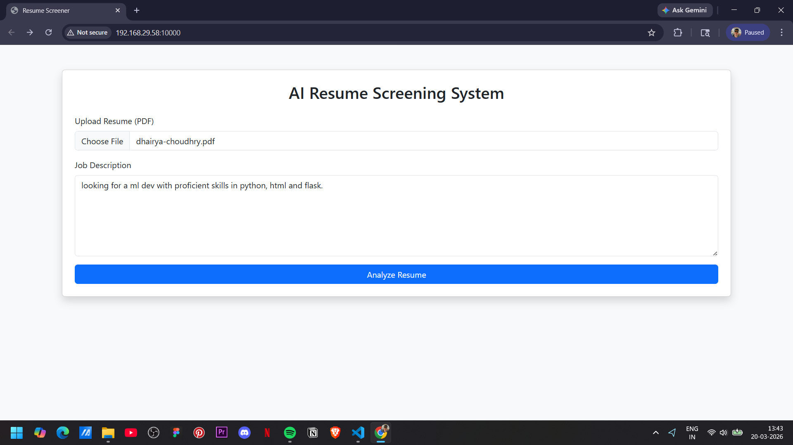
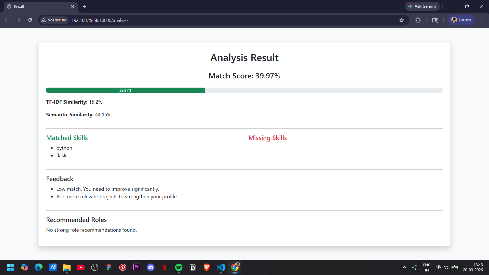

# 🧠 AI Resume Screener

An AI-powered web application that analyzes resumes and evaluates them based on job descriptions using NLP techniques.

---

## 🚀 Features

- 📄 Upload resume (PDF/Text)
- 🧠 AI-based resume analysis
- 📊 Match score with job description
- 🔍 Keyword extraction & comparison
- ⚡ Fast and simple UI

---

## 🖼️ Project Demo

### 📌 Website Preview




### 🎥 Demo Video
[Watch Demo](assets/ai-resume-screener.mp4)

---

## 🛠️ Tech Stack

- **Frontend:** HTML, CSS
- **Backend:** Python (Flask/Django – mention yours)
- **AI/NLP:** Python, NLP libraries (like sklearn, nltk, etc.)
- **Other:** Git, GitHub

---

## ⚙️ How It Works

1. User uploads a resume
2. System extracts text from the resume
3. Job description is provided
4. NLP model compares both
5. Matching score + insights are generated

---

## 🧪 Installation & Setup

```bash
# Clone the repository
git clone https://github.com/dchoudhry7/ai-resume-screener.git

# Navigate to project folder
cd ai-resume-screener

# Install dependencies
pip install -r requirements.txt

# Run the app
python app.py